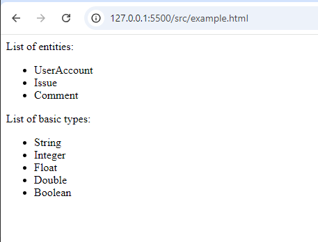

# Projor 101

This is a basic example template for [Projor](https://projor.io) to showcase how to start generating code with it. It contains some example entities in `.entities` file, a simple schema in `/schema` folder, a basic type description in `/data` and a couple example template files in `/template` folder.

## Install Projor

You can download an installer for [Projor](https://projor.io) from here : [https://download.projor.io](https://download.projor.io/)

## Generate your first project

Navigate to your projects root folder in a command prompt / terminal and run:

` projor generate`

## Observe generated files

You will find some new files in `/example` folder. You will find a separate file for each Entity described in `.entities` file, named `<name-of-entity>.example.text`and a single file, `map.example.text` that contains a list of all Entities and basic types.

## Play around with templates

Now you can take a deeper look into the template files. They are generated with [Mustache](https://mustache.github.io/), so it helps to know the basics of Mustache syntax. They start with a frontmatter, separated from the template by a `---` line. In this frontmatter you can specify the name of the file and you can use some helpers, like `forEach` or `map`.

### `forEach.example.ptemplate.mustache`

```
{
    "forEach": "entities",
    "filename": "src/{{kebabCase name}}.entity.text"
}
---
```

This template has a `forEach` helper in frontmatter, which makes it generate one file for each Entity described in `.entities`. The helper `kebabCase` specifies spelling for the file name, in this case `UserAccount` for example becomes `user-account`.
In the template you will find the most relevant syntaxes you need to generate any kind of text files - and therefore: code! - you need.

### `map.example.ptemplate.mustache`

```
{
    "map": { "basic": "basic", "entities": "entities" },
    "filename": "src/map.example.text"
}
---
```
The `map` helper is useful when you need to generate a single file. In this case you have access to two data collections:
- `basic` from from `/data/basic.pdata.yaml`
- `entities` from `.entities` file
 
You can create more data collections by creating `.pdata.yaml` files in `/data` folder.

And the fun part starts here!

## Try to generate some real code!

If you want to generate `.html` files for example, all you need to do is the following:

- create a template file in `/template` folder, let's name it `example.html.ptemplate.mustache` and type / copy-paste the following:
```
{
"map": { "basic": "basic", "entities": "entities" },
"filename": "src/example.html"
}
---
<html>
    <body>
    List of entities:
    <ul>
    {{#each entities}}
    <li>{{name}}</li>
    {{/each}}
    </ul>

    List of basic types:
    <ul>
    {{#each basic}}
    <li>{{name}}</li>
    {{/each}}
    </ul>
</body>
</html>
```
  Save it and run `projor generate` again. You should see a new file in `/src` folder named `example.html`. That's the file you just generated, let's see what it does! Load it in a browser - or even better: if you use VS Code, start it up with Live Server and navigate to `http://127.0.0.1:5500/src/example.html` - and you should see this:




Congratulations, you created your very first, very simple Projor project! Keep going :)